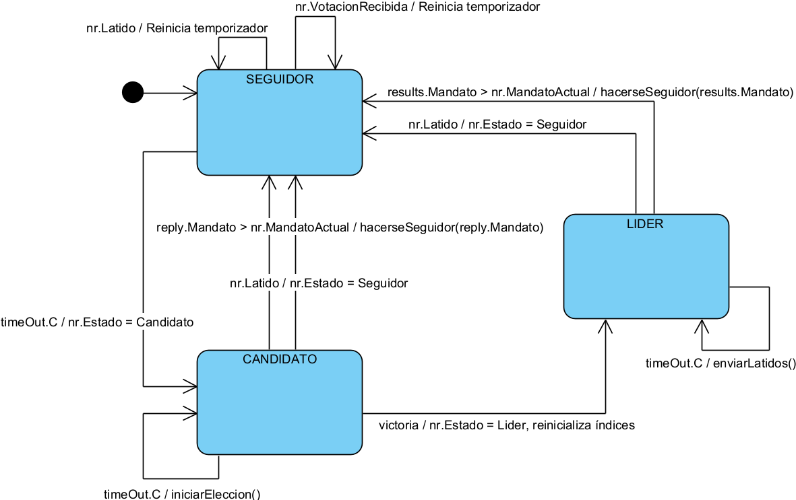
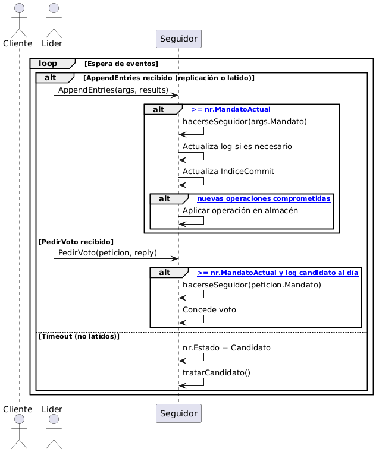
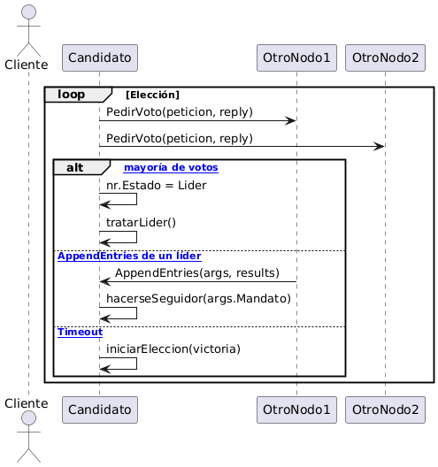
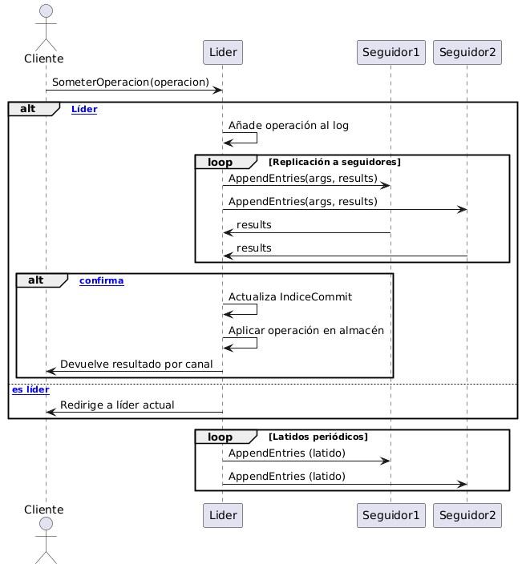

% Memoria Práctica 4 \
    Conceptos y Mecanismos Básicos \
    Sistemas Distribuidos 
%   Héctor Lacueva Sacristán \ NIP: 869637 \
    Adrián Nasarre Sánchez \ NIP: 869561 \
    GRUPO TARDES 3-3
% Fecha: 02/06/2025

\newpage

# Introducción

En esta memoria se describe el desarrollo de la Práctica 4 de Sistemas Distribuidos, que consiste en la extensión y mejora de la implementación del algoritmo de consenso Raft realizada en la Práctica 3. El objetivo principal de esta práctica es dotar al sistema de la capacidad de replicar operaciones de lectura y escritura sobre una base de datos clave-valor, garantizando la consistencia y el compromiso de las operaciones en todos los nodos del clúster, así como exponer una API remota para la interacción con clientes y la realización de pruebas de integración más exhaustivas.

# Descripción de la Práctica

La práctica parte de la base de la Práctica 3, donde se implementó el protocolo Raft para la elección de líder, replicación de logs y tolerancia a fallos. En esta nueva entrega, se han añadido y modificado funcionalidades clave para soportar la replicación efectiva de operaciones de lectura y escritura, la aplicación de operaciones comprometidas en una máquina de estados (almacén clave-valor), y la exposición de una API remota para la interacción con clientes y pruebas automáticas.

Entre las principales novedades destacan:

- Implementación de la función `SometerOperacion`, que permite a los clientes enviar operaciones de lectura y escritura al clúster Raft y obtener el resultado una vez comprometidas.
- Gestión de canales para la devolución de resultados de operaciones comprometidas.
- Aplicación efectiva de operaciones en la máquina de estados (almacén) tras el compromiso.
- Exposición de nuevas llamadas RPC para obtener el estado del nodo, el estado de replicación y someter operaciones remotamente.
- Adaptación de los tests de integración para validar la replicación y el compromiso de operaciones, así como la consistencia del almacén en todos los nodos.

# Diseño e Implementación

## Estructuras de Datos

La estructura principal sigue siendo `NodoRaft`, que representa cada réplica del sistema. Sus campos principales son:

- **Nodos**: lista de direcciones de todos los nodos del clúster.
- **Yo**: identificador del nodo actual.
- **IdLider**: índice del nodo que actúa como líder.
- **MandatoActual**: término actual del nodo.
- **MiVoto**: nodo al que se ha votado en el mandato actual.
- **Log**: array de entradas de registro (`EntradaRegistro`), cada una con índice, mandato y operación (`TipoOperacion`).
- **Estado**: estado actual del nodo (`Seguidor`, `Candidato`, `Lider`).
- **VotacionRecibida**: canal para recibir votos.
- **Latido**: canal para recibir heartbeats.
- **IndiceCommit**: última entrada comprometida.
- **SiguienteIndice** y **IndiceEntradaReplicada**: arrays para gestionar la replicación y sincronización de logs en los seguidores.
- **CanalAplicarOperacion**: canal por el que se envían operaciones comprometidas a la máquina de estados.
- **canalesValorADevolver**: mapa de canales para devolver el resultado de cada operación comprometida al cliente correspondiente.
- **Almacen**: mapa clave-valor que representa la máquina de estados donde se aplican las operaciones comprometidas.

Otras estructuras relevantes:

- **TipoOperacion**: describe la operación a replicar (leer/escribir, clave, valor).
- **AplicaOperacion**: mensaje para aplicar una operación comprometida.
- **ArgsPeticionVoto** y **RespuestaPeticionVoto**: argumentos y respuesta para la petición de voto.
- **ArgAppendEntries** y **Results**: argumentos y respuesta para la replicación de logs y heartbeats.

## Funciones Principales y Cambios respecto a Práctica 3

A continuación se describen las funciones implementadas o modificadas en la Práctica 4, razonando su lógica y su papel en el consenso Raft y la replicación de operaciones:

- **NuevoNodo**: Inicializa todos los campos de la estructura, crea los canales de comunicación, el almacén clave-valor y lanza las goroutines principales (`tratarOperaciones` y `tratarNodo`). Ahora también inicializa el mapa de canales para devolver resultados de operaciones y el almacén.

- **SometerOperacion**: Permite a un cliente enviar una operación (lectura o escritura). Si el nodo es líder, añade la operación al log, lanza la replicación a los seguidores y espera a que la mayoría la confirme antes de responder con el resultado de la operación. Utiliza un canal específico para cada operación para devolver el resultado al cliente una vez comprometida y aplicada en la máquina de estados. Si no es líder, informa al cliente del líder actual.

- **comprometerOperacion / enviarOperacionNodo**: Gestionan la replicación y el compromiso de operaciones en el log. `comprometerOperacion` coordina la replicación en paralelo y espera a la mayoría antes de confirmar la operación al cliente. `enviarOperacionNodo` reintenta la replicación hasta el éxito o hasta que el nodo deje de ser líder.

- **tratarOperaciones / aplicarOperacion**: Se encargan de aplicar las operaciones comprometidas en la máquina de estados (almacén clave-valor) y devolver el resultado al cliente a través del canal correspondiente. `tratarOperaciones` escucha en el canal de operaciones comprometidas y aplica la operación en el almacén, devolviendo el resultado si el nodo es líder.

- **ObtenerEstadoNodo / ObtenerEstadoReplicacionNodo / SometerOperacionRaft**: Nuevas llamadas RPC expuestas para obtener el estado del nodo, el estado de replicación (log y almacén) y someter operaciones remotamente. Permiten la integración con los tests automáticos y la validación de la replicación y el compromiso de operaciones.

- **Cambios en la gestión de logs y replicación**: Se han mejorado los métodos de actualización del log, comprobación de logs previos y aplicación de operaciones para garantizar la consistencia y el compromiso efectivo de las operaciones en todos los nodos.

- **Tests de integración**: Se han adaptado y ampliado los tests para comprobar no solo la elección de líder y la tolerancia a fallos, sino también la replicación y el compromiso de operaciones, así como la consistencia del almacén en todos los nodos tras operaciones concurrentes y fallos.

# API Remota y Pruebas

La nueva API remota expone las siguientes llamadas RPC:

- **SometerOperacionRaft**: Permite a un cliente remoto enviar una operación de lectura o escritura al clúster Raft y recibir el resultado una vez comprometida y aplicada.
- **ObtenerEstadoNodo**: Permite consultar el estado actual de un nodo (mandato, si es líder, id del líder).
- **ObtenerEstadoReplicacionNodo**: Permite consultar el log y el almacén actual de un nodo, útil para validar la replicación y la consistencia en los tests.

Los tests de integración han sido adaptados para utilizar esta API y validar los siguientes aspectos:

- Elección de líder y tolerancia a fallos.
- Replicación y compromiso de operaciones de lectura y escritura.
- Consistencia del almacén clave-valor en todos los nodos tras operaciones concurrentes y tras fallos y recuperaciones.
- Correcta redirección de operaciones a través del líder.

# Diagramas de Estados y Secuencia

## Diagrama de Estados

El diagrama de estados de la máquina Raft se mantiene respecto a la Práctica 3, mostrando las transiciones entre los estados de Seguidor, Candidato y Líder:

|Máquina de estados|
|:-:|
||

### Tabla de transiciones de la máquina de estados

| Estado inicial | Estado final | Condición (evento/código)                                   | Salida/Acción (función/efecto)                  |
|----------------|-------------|------------------------------------------------------------|--------------------------------------------------|
| Seguidor       | Candidato   | Timeout: `<-timeOut.C` en `tratarSeguidor()`               | `nr.Estado = Candidato`                          |
| Seguidor       | Seguidor    | Latido: `<-nr.Latido` en `tratarSeguidor()`                | Reinicia temporizador                            |
| Seguidor       | Seguidor    | Voto dado: `<-nr.VotacionRecibida` en `tratarSeguidor()`   | Reinicia temporizador                            |
| Candidato      | Líder       | Victoria: `<-victoria` en `tratarCandidato()`              | `nr.Estado = Lider`, reinicializa índices        |
| Candidato      | Seguidor    | Latido: `<-nr.Latido` en `tratarCandidato()`               | `nr.Estado = Seguidor`                           |
| Candidato      | Candidato   | Timeout: `<-timeOut.C` en `tratarCandidato()`              | Llama a `iniciarEleccion()`                      |
| Candidato      | Seguidor    | reply.Mandato > nr.MandatoActual en `tratarVotoValido()` o `tratarLatidoValido()` | `hacerseSeguidor(reply.Mandato)`                 |
| Líder          | Seguidor    | Latido: `<-nr.Latido` en `tratarLider()`                   | `nr.Estado = Seguidor`                           |
| Líder          | Seguidor    | results.Mandato > nr.MandatoActual en `tratarLatidoValido()` | `hacerseSeguidor(results.Mandato)`               |
| Líder          | Líder       | Timeout: `<-timeOut.C` en `tratarLider()`                  | Llama a `enviarLatidos()`                        |

## Diagramas de Secuencia

A continuación se presentan los diagramas de secuencia actualizados para la Práctica 4, reflejando la interacción con la máquina de estados (almacén), la gestión de operaciones comprometidas y la devolución de resultados a través de canales.

### Nodo Seguidor

|Diagrama de Secuencia Seguidor|
|:-:|
||

### Nodo Candidato

|Diagrama de Secuencia Candidato|
|:-:|
||

### Nodo Líder

|Diagrama de Secuencia Líder|
|:-:|
||

En cada diagrama se representan los bucles de espera, las alternativas de eventos y las llamadas exactas del código Go que implementan la lógica de Raft en cada estado, así como la aplicación de operaciones comprometidas en la máquina de estados y la devolución de resultados a los clientes.

# Pruebas Realizadas

A continuación se describen en detalle las pruebas de integración implementadas para validar el correcto funcionamiento del sistema Raft en la Práctica 4:

## T1: soloArranqueYparada
**Objetivo:** Verificar que tras el arranque del clúster, ningún nodo se proclama líder si no hay actividad ni heartbeats.

**Secuencia:**
- Se inician los tres nodos del clúster.
- Se consulta el estado de cada nodo para comprobar que todos están en el mandato 0, no se consideran líderes y no hay líder asignado.
- Se detienen todos los nodos.

**Validación:**
- Ningún nodo debe autoproclamarse líder sin haber recibido heartbeats ni haber iniciado un proceso de elección.
- El sistema permanece estable y sin liderazgo hasta que se produzca actividad.

## T2: ElegirPrimerLider
**Objetivo:** Comprobar que el sistema es capaz de elegir correctamente un primer líder en un entorno estable.

**Secuencia:**
- Se arrancan los tres nodos del clúster.
- Se espera a que se produzca una elección de líder.
- Se consulta el estado de todos los nodos para verificar que solo uno se considera líder y el resto son seguidores.
- Se detienen todos los nodos.

**Validación:**
- Solo debe haber un líder en el clúster.
- El resto de nodos deben reconocer al líder y actuar como seguidores.
- El mandato debe incrementarse respecto al arranque inicial.

## T3: FalloAnteriorElegirNuevoLider
**Objetivo:** Validar la tolerancia a fallos y la capacidad de reelección automática de un nuevo líder tras la caída del anterior.

**Secuencia:**
- Se inicia el clúster y se espera a que se elija un líder.
- Se desconecta el nodo líder simulando un fallo.
- Se espera un tiempo suficiente para que se detecte la caída y se inicie una nueva elección.
- Se consulta el estado de los nodos restantes para comprobar que se ha elegido un nuevo líder.
- Se detienen todos los nodos.

**Validación:**
- Tras la desconexión del líder, debe elegirse automáticamente un nuevo líder entre los nodos activos.
- El sistema debe seguir funcionando y manteniendo el consenso.

## T4: tresOperacionesComprometidasEstable
**Objetivo:** Comprobar la replicación y compromiso de operaciones en un entorno estable, y la correcta redirección de peticiones a través del líder.

**Secuencia:**
- Se arranca el clúster y se espera a que se elija un líder.
- Se identifica un nodo que no es líder y se le envía una operación; el sistema debe redirigir la petición al líder.
- Se envían tres operaciones consecutivas al líder (lectura y escritura).
- Se comprueba que las operaciones se replican y comprometen correctamente en la mayoría de nodos y que el almacén es consistente.
- Se detienen todos los nodos.

**Validación:**
- Las operaciones enviadas a un nodo no líder deben ser redirigidas correctamente al líder.
- Todas las operaciones deben quedar comprometidas y replicadas en la mayoría de nodos, garantizando la consistencia.
- El sistema responde correctamente a las peticiones de los clientes y mantiene la integridad del log y del almacén.

## T5: AcuerdoAPesarDeDesconexionesDeSeguidor
**Objetivo:** Validar que el sistema puede seguir comprometiendo operaciones aunque uno de los seguidores esté desconectado, y que al reconectarse recupera el estado consistente.

**Secuencia:**
- Se arranca el clúster y se elige un líder.
- Se compromete una operación.
- Se desconecta un seguidor.
- Se comprometen varias operaciones con el seguidor desconectado.
- Se reconecta el seguidor y se comprueba que recupera el estado consistente.
- Se detienen todos los nodos.

**Validación:**
- El sistema debe poder comprometer operaciones con mayoría.
- El seguidor reconectado debe recuperar el log y el almacén consistente.

## T5: SinAcuerdoPorFallos
**Objetivo:** Comprobar que no se puede comprometer operaciones si no hay mayoría de nodos activos.

**Secuencia:**
- Se arranca el clúster y se elige un líder.
- Se desconectan dos seguidores.
- Se intenta comprometer operaciones (deben fallar).
- Se reconectan los seguidores y se comprueba que se puede volver a comprometer operaciones.
- Se detienen todos los nodos.

**Validación:**
- No se deben comprometer operaciones sin mayoría.
- Al recuperar la mayoría, el sistema debe volver a funcionar correctamente.

## T5: SometerConcurrentementeOperaciones
**Objetivo:** Validar la capacidad del sistema para comprometer operaciones concurrentes y mantener la consistencia.

**Secuencia:**
- Se arranca el clúster y se elige un líder.
- Se compromete una operación inicial.
- Se lanzan varias operaciones concurrentes (lecturas y escrituras).
- Se comprueba la consistencia del log y del almacén en todos los nodos.
- Se detienen todos los nodos.

**Validación:**
- Todas las operaciones concurrentes deben quedar comprometidas y aplicadas correctamente.
- El log y el almacén deben ser consistentes en todos los nodos.

# Resultados y Conclusiones

Las pruebas realizadas demuestran que la implementación cumple con los requisitos del algoritmo Raft extendido en la Práctica 4: se elige un único líder, se detectan y recuperan fallos de nodos, y las operaciones de lectura y escritura se replican y comprometen correctamente en la mayoría de nodos. El sistema es robusto ante fallos y garantiza la consistencia de los datos replicados y del almacén clave-valor. La gestión de concurrencia mediante goroutines y canales, junto con el uso de RPCs y la nueva API remota, permite una coordinación eficiente y tolerante a fallos en el clúster distribuido, así como la validación exhaustiva mediante pruebas automáticas.

La práctica ha permitido profundizar en los conceptos de consenso distribuido, replicación de estado y compromiso de operaciones, y la solución desarrollada es fiable, extensible y preparada para futuras mejoras y ampliaciones.
