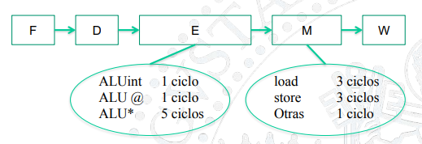
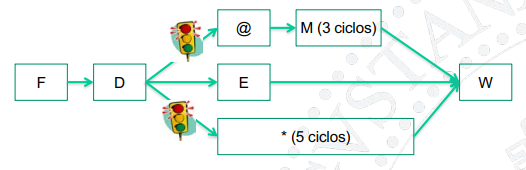
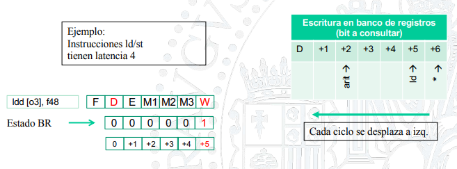
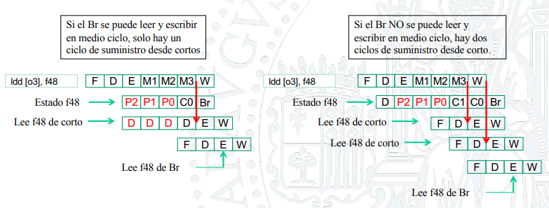
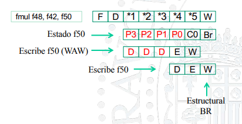

\newpage

# Riesgos

## Estructurales

### Causa
No disponibilidad de un módulo cuando se necesita.

### Solución

En general se solucionan duplicando módulos y segmentando ALUs.

## De datos

### Causa

No disponibilidad de un dato cuando se necesita.

### Solución

Ver algunas soluciones en [_Dependencias_](#dependencias).

## De control

### Causa

Desconocimiento de cuál es la próxima instrucción que debe ejecutarse, culpa de los **saltos**.

### Solución

#### Solución 1: Detener pipeline.

Detener hasta que se conozca si el salto se produce. Demasiado lenta,

#### Solución 2: Asumir salto no tomado (NT).

Si fallo de predicción, desechar todas las instrucciones en ejecución equivocadamente.
Funciona bien si hay muchos saltos NT.

#### Solución 3: Predicción dinámica de saltos.

Basada en eventos pasados. Predecimos que ocurrirá lo mismo que la vez anterior.

El predictor almacena:
- La parte menos significativa de la dirección de la instrucción de salto.
- Un bit indicando si T o NT la última vez.

Funciona bien en bucles.

#### Solución 4: Saltos retardados

La siguiente instrucción a la de salto siempre se ejecuta. El compilador selecciona la instrucción adecuada.

# Dependencias vs. Riesgos

Un riesgo es una limitación hardware.

Una dependencia es una propiedad del código.
```
subcc **r1**, r2, r3
addcc r5, **r1**, r4
```

Si hay dependencia puede existir o no riesgo.

# Dependencias

## Dependencia verdadera (True dependency)

### Descripción

También conocida como dependencia **productor-consumidor**.

```c
sub **$2**, $1, $3 ; productor
add $4, **$2**, $5 ; consumidor a distancia 1
or  $6, $7, **$2** ; consumidor a distancia 2 
```
Causan riesgo de **lectura después de escritura** (LDE o RAW).

### Soluciones

#### Solución 1: NOPs

El **compilador** se encarga de garantizar que no se produzcan riesgos, para ello se **insertan** instrucciones **NOP** entre aquellas instrucciones que tengan dependencias de datos.

**Desventaja**: la ejecución se hace más lenta.

#### Solución 2: Anticipación de operandos

Anticipar operandos mediante cortos. No siempre soluciona los riesgos, por ejemplo la instrucción **LOAD**. En ese caso **habría que detener el procesador**. De esto se encarga la **Unidad de detención del pipeline.** (introducir una NOP).

También se conoce como fordwarding.

#### Solución 3: Reordenamiento del código

**Reordenamiento del código** para minimizar el número de detenciones. Lo hace el compilador. Algunas de las estrategias más comunes son el **loop unrolling** y el software pipelining.


## Dependencia de salida (Output dependency)

Aparece cuando dos instrucciones escriben en el mismo registro.

```c
sub **$2**, $1, $3
add **$2**, $4, $5
```

Causan riesgo de **escritura después de escritura** (WAW).

## Antidependencia (Antidependency)

Aparece cuando una instrucción lee un registro y después otra lo modifica.

```c
sub $2, **$1**, $3
add **$1**, $4, $5
```

Causan riesgo de **escritura después de lectura** (WAR).

\newpage

# Interrupciones

\newpage

# Multiciclo

Las etapas tienen latencias dependiendo de lo que se quiera realizar. Por ejemplo podríamos pensar en:

- Añadimos multiplicación float (*):
  - Latencia de operación 5 ciclos (*1, *2, *3, *4, *5).
  - Latencia de inicio de $\frac{1}{5}$ ciclos.

- Modelamos una cache más realista:
  - Latencia de operación 3 ciclos (M1, M2, M3).
  - Latencia de inicio de $\frac{1}{3}$ ciclos.

Aparecen nuevos casos de parada:

- Load seguido de consumidora a distancias 1, 2 y 3.
- Multiplicación seguida de consumidora a distancias 1, 2, 3, 4 y 5.
- Estructurales.

## Un camino de ejecución



- **Terminación en orden**.
- **No hay riesgos WAW, WAR**.
- **Riesgos estructurales**:
  - Instrucción FLOAT seguido de cualquiera.
  - ld/st seguido de ld/st.
  - ld/st seguido de +/-.

## Varios caminos de ejecución



- **Terminación en desorden**.
  - Interrupciones imprecisas.
- **Riesgos WAW**.
- **Riesgos estructurales**:
  - FLOAT seguido de FLOAT.
  - FLOAT seguido de ld/st en W.
  - FLOAT sesguido de +/- en W.
  - ...

Se crean cortocircuitos desde salida de cada UF a entradas de cada UF.

### SCOREBOARD

Se usa para el correcto funcionamiento del procesador con varios caminos. Proporciona gestión de riesgos estructurales, de datos y de control.

#### Estructurales en UFs

**Para cada UF multiciclo**:

- Contador que indica cuantos ciclos quedan en estado ocupado. Cuando se lanza una operación de latencia de inicio X, el contador se inicializa con el valor X-1.

#### Estructurales en BR

**Vector de bits puerto escritura BR**:

Indica para los próximos ciclos, si el puerto de escritura está ocupado o libre. Por ejemplo:



Cada instrucción lanzada desde etapa D, si escribe en BR:

- Comprueba que el ciclo que necesita el wBR está libre.
  - Si está **ocupado**, **espera**.
  - Si está **libre**, lo **ocupa** y continúa.

#### RAW y control de cortos



Cuando una instrucción lee en su etapa D el estado de un registro fuente, éste puede ser:

- P: pendiente. La instrucción no puede avanzar.
- C: corto. Se podrá servir desde corto cuando la instrucción llegue a etapa E.
- Br: banco de registros. El valor leído en este mismo ciclo en etapa D es el válido. No se activa corto.

Dependiendo de si tenemos banco de registros capaz de leer y escribir en medio ciclo o no, tendremos un solo ciclo de serviccio desde cortos o dos.

#### WAW

Instrucción "simple" (latencia 1) lee en su etapa D el estado de su registro destino.

- Estados P3, P2 y P1: la instrucción no puede avanzar.
- **Si avanza escribiría en desorden**. 

