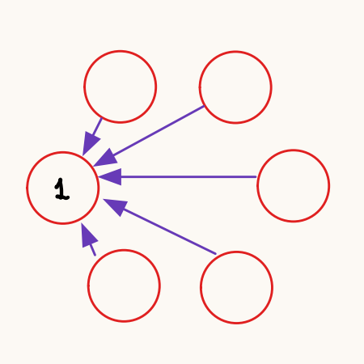
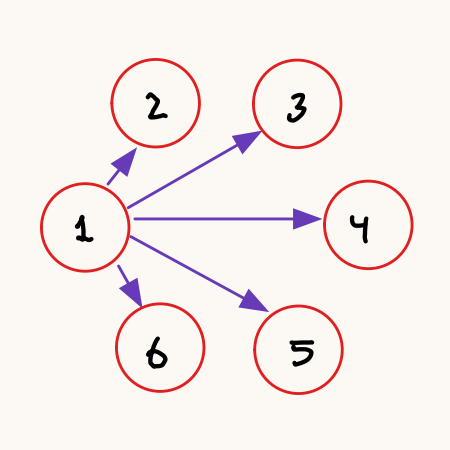
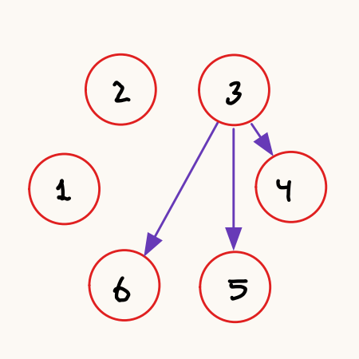
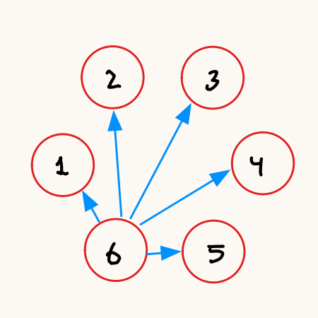
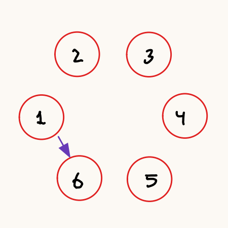
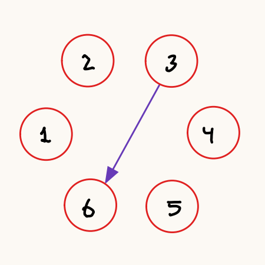

\newpage

# Análisis de Prestaciones de Red

## Conexión TCP en la misma máquina

Ambos procesos son lanzados en la máquina r14 (192.168.3.14).

|Resultado|Prueba 1| Prueba 2 | Prueba 3 | Prueba 4 | Prueba 5 | Mínimo | Media | Máximo |
|:-:|:-:|:-:|:-:|:-:|:-:|:-:|:-:|:-:|
|Conexión fallida|521.19µs|521.34µs|662.86µs|584.53µs|501.32µs|:-:|:-:|:-:|
|Conexión establecida|1.186ms|1.244ms|1.119ms|1.227ms|1.138ms|:-:|:-:|:-:|

## Conexión TCP en distinta máquina

El cliente es lanzado en la máquina r14 (192.168.3.14) y el servidor en la máquina r15 (192.168.3.15).

|Resultado|Prueba 1| Prueba 2 | Prueba 3 | Prueba 4 | Prueba 5 | Mínimo | Media | Máximo |
|:-:|:-:|:-:|:-:|:-:|:-:|:-:|:-:|:-:|
|Conexión fallida|874.52µs|583.47µs|615.49µs|591.78µs|631.84µs|:-:|:-:|:-:|
|Conexión establecida|1.218ms|1.218ms|1.22ms|1.315ms|1.118ms|:-:|:-:|:-:|

> Aquí añadir una explicación de qué realiza la operación Dial en el primer caso (cuando el servidor no está desplegado) y cuando está desplegado.

## Envío de una letra con UDP en la misma máquina
Ambos procesos son lanzados en la máquina r14 (192.168.3.14).

|Resultado|Prueba 1| Prueba 2 | Prueba 3 | Prueba 4 | Prueba 5 | Mínimo | Media | Máximo |
|:-:|:-:|:-:|:-:|:-:|:-:|:-:|:-:|:-:|
|Envío de una letra|316.662µs|305.791µs|324.18µs|312.199µs|345.347µs|:-:|:-:|:-:|

## Envío de una letra con UDP en distinta máquina
El cliente ha sido lanzado en la máquina r14 (192.168.3.14) y el servidor en la máquina r15 (192.168.3.15).

|Resultado|Prueba 1| Prueba 2 | Prueba 3 | Prueba 4 | Prueba 5 | Mínimo | Media | Máximo |
|:-:|:-:|:-:|:-:|:-:|:-:|:-:|:-:|:-:|
|Envío de una letra|659.304µs|658.174µs|629.916µs|558.083µs|576.935µs|:-:|:-:|:-:|

# Sincronización Barrera Distribuida

## Metodología

Para este apartado se pedía completar el código proporcionado con la funcionalidad para el correcto funcionamiento de una barrera distribuida.
Lo primero fue analizar el código para comprender el funcinamiento ya implementado de la barrera.
Aparte de errores de sintaxis, faltaba completar la parte final del código que se encarga del fin de la sincronización.
La barrera debe esperar a que le lleguen los mensajes de los demás procesos, lo que implica que la sincronización ha acabado.

Un aspecto que se ha añadido es un tiempo de espera para que se envíen todos los mensajes antes de acabar el proceso.
Esto se debe a que al terminar el proceso (llegar al final del `main`) todas las gorutinas son matadas y,
 por tanto, habría procesos que podrían no llegar a recibir todos los mensajes.

El funcionamiento de la barrera se puede ver en el siguiente diagrama de secuencia.
En este caso, el ejemplo se ha realizado para la sincronización de 3 procesos.

| Diagrama de secuencia de la sincronización de la barrera |
|:-:|
| |

Ante la sospecha de que el algoritmo no era eficiente por la cantidad de mensajes enviados, 
se ha realizado un análisis de distintos algoritmos simples de barrera distribuida que sea más eficiente al propuesto.
Y se ha realizado la implementación de la barrera más eficiente encontrada para verificar su correcto funcionamiento.

## Análisis

### Barrera 1: Todos informan a todos (Ejemplo propuesto)

En este caso tenemos N nodos que se quieren sincronizar.
Al acceder a la barrera el nodo i, envía un mensaje de acceso al resto de nodos y espera recibir los N-1 mensajes del resto de nodos.

Es el diseño más simple que se puede pensar pero ineficiente a gran escala por la cantidad de mensajes que se envían.
El número de mensajes que son enviados en una sincronización es de `n*(n-1)`, cada nodo envía un mensaje al resto de nodos.
Por tanto, la complejidad es `O(n²)`.

#### Funcionamiento

| Nodo 1 accede a la barrera | Nodo 1 puede salir de la barrera |
|:-:|:-:|
| {width=33%} | {width=33%} |

### Barrera 2: Informar a mayores y esperar respuesta

En este caso tenemos N nodos que se quieren sincronizar.
Al acceder a la barrera el nodo i, envía el mensaje a los nodos en el rango [i+1, N].
Cuando el nodo N (nodo con mayor identificador), recibe los N-1 mensajes y está dentro de la barrera, envía un mensaje a todos los nodos para notificar de que la sincronización se ha completado.
Cabe destacar que este algoritmo necesita que las listas de nodos deben estar en el mismo orden en todos los nodos.

La cantidad de mensajes enviados para llevar a cabo un sincronización es de `n*(n-1)/2 + n-1`, cada nodo envía un mensaje a los nodos mayores a él.
Por tanto, la complejidad sigue siendo `O(n²)`.

#### Funcionamiento

|Nodo 1 accede a la barrera|Nodo 3 accede a la barrera|Nodo 6 informa finalización|
|:-:|:-:|:-:|
||| |

### Barrera 3: Solo se informa al nodo mayor

En este caso tenemos N nodos que se quieren sincronizar.
Al acceder a la barrera el nodo i, envía un mensaje al nodo N, que trataremos como **coordinador**.
Cuando el **coordinador** (nodo con mayor identificador), recibe los N-1 mensajes y está dentro de la barrera, envía un mensaje a todos los nodos para notificar de que la sincronización se ha completado.
Al igual que en la barrera anterior la lista de nodos debe estar en el mismo orden en todos los nodos.

La cantidad de mensajes enviados para llevar a cabo un sincronización es de `2*(n-1)`, cada nodo envía un mensaje al nodo N, y este envía otro de vuelta.
Por tanto, la complejidad para este caso es `O(n)`.
Un detalle interesante sobre este algoritmo es que solo el nodo **coordinador** necesita conocer a todos los nodos que interactúan en la sincronización.

#### Funcionamiento

|Nodo 1 accede a la barrera|Nodo 3 accede a la barrera|Nodo 6 informa finalización|
|:-:|:-:|:-:|
||| |

### Otras barreras

También se ha pensado en otras barreras buscando una complejidad `O(n)`.
Entre ellas se descartó un diseño que consistía en que el nodo i envía al nodo i+1 un mensaje de acceso cuando ya ha recibido un mensaje de acceso del nodo i-1.
Esto se debe a lo ineficiente que sería el acceso en el caso peor. El nodo 1 le envía al 2, el 2 al 3, y así hasta el N. Si N es muy grande, se perdería mucho tiempo.

Me cago en los muertos del profesor que hizo esta práctica

