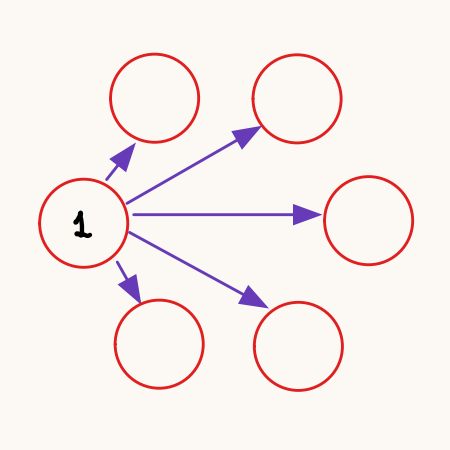
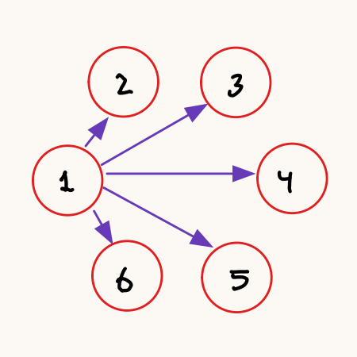
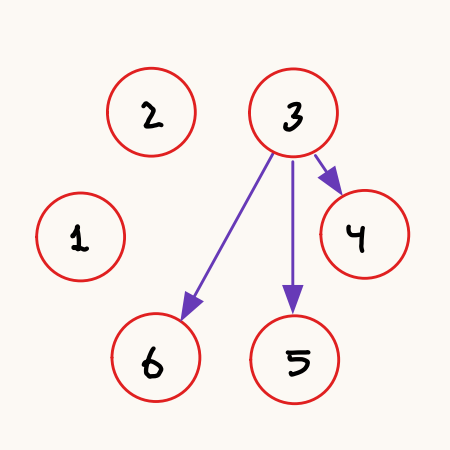
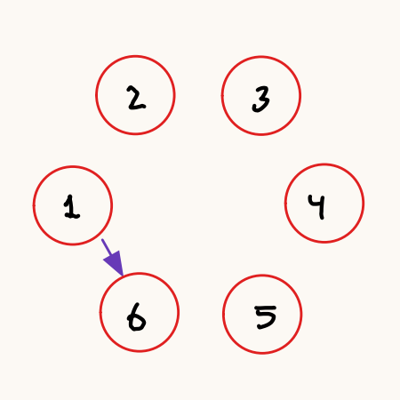
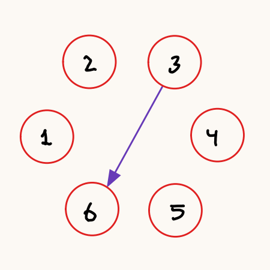

% Memoria Práctica 1:
    Conceptos y Mecanismos Básicos
    Sistemas Distribuidos
% Autor: Héctor Lacueva Sacristán
    NIP: 869637
% Fecha: 31/03/2025

\newpage

# Análisis de Prestaciones de Red

Para cada caso se han ejecutado 7 pruebas y se ha extraído la media de los resultados.

## Prestaciones de red para conexión TCP

### Conexión TCP en la misma máquina

Ambos procesos son lanzados en la máquina r14 (192.168.3.14).
Se han obtenido los siguientes resultados:

|Resultado|Prueba 1|Prueba 2|Prueba 3|Prueba 4|Prueba 5|Prueba 6|Prueba 7|
|:-:|:-:|:-:|:-:|:-:|:-:|:-:|:-:|
|Error|529,38µs|654,73µs|551,565µs|573,454µs|675,101µs|682,433µs|549,88µs|
|Ok|1,055057ms|917,522µs|844,302µs|1,121964ms|997,429µs|976,91µs|1,023336ms|

La media por tanto es de **602.36µs** para el caso de fallo de conexión y de **0.9909ms** para el caso de conexión establecida.

### Conexión TCP en distinta máquina

El cliente es lanzado en la máquina r14 (192.168.3.14) y el servidor en la máquina r15 (192.168.3.15).
Se han obtenido los siguientes resultados:

|Resultado|Prueba 1|Prueba 2|Prueba 3|Prueba 4|Prueba 5|Prueba 6|Prueba 7|
|:-:|:-:|:-:|:-:|:-:|:-:|:-:|:-:|
|Error|695,093µs|635,111µs|636,019µs|850,129µs|729,796µs|719,167µs|638,518µs|
|Ok|1,228148ms|1,220815ms|1,358593ms|1,456926ms|1,107537ms|1,174574ms|1,236796ms|

La media por tanto es de **700.55µs** para el caso de fallo de conexión y de **1.2548ms** para el caso de conexión establecida.

### Conclusiones

#### Conclusiones con respecto fallo de Dial.

El coste de ejecutar la **operación Dial de TCP en Golang** se debe a que se encarga de establecer la conexión con un servidor.
Para ello, lleva a cabo el "**3-way-handshake**" propio del protocolo TCP:

1. Cliente envía `SYN`.
2. Servidor recibe `SYN` y envía recibe `SYN+ACK`.
3. Cliente recibe `SYN+ACK` y envía `ACK`.

Cuando **Dial falla**, en nuestro caso porque el servidor no está desplegado se lleva a cabo lo siguiente:

1. Cliente envía `SYN`.
2. Al no haber ningún proceso escuchando en el puerto al que se ha realizado la petición,
   el SO envía un `RST`, lo que lleva a un error de conexión.

Se llevan a cabo dos envíos, uno para `SYN` y otro para `RST`.

Cuando **Dial funciona correctamente** se realiza el protocolo completo, de ahí los tiempos superiores.

#### Conclusiones con respecto a la ejecución en máquinas diferentes.

Al ejecutar la operación en distinta máquina los paquetes deben ser enviados a través de la red del rack que conecta las diferentes máquinas, lo que conlleva un sobrecoste.
Al ejecutar las operaciones en la misma máquina los paquetes se envían a través de la red de la propia máquina, y por lo general, esta es más rápida que la red del rack.
De ahí que los tiempos para la ejecución en la misma máquina sean menores que para distintas máquinas.

## Prestaciones de red para conexión UDP

### Envío de una letra con UDP en la misma máquina

Ambos procesos son lanzados en la máquina r14 (192.168.3.14).
Se han obtenido los siguientes resultados:

|Resultado|Prueba 1|Prueba 2|Prueba 3|Prueba 4|Prueba 5|Prueba 6|Prueba 7|
|:-:|:-:|:-:|:-:|:-:|:-:|:-:|:-:|
|Char Sent|296,296µs|321,37µs|286,778µs|294,055µs|326,185µs|354,981µs|320,019µs|

La media del RTT es de **314,241µs**.

### Envío de una letra con UDP en distinta máquina
El cliente ha sido lanzado en la máquina r14 (192.168.3.14) y el servidor en la máquina r15 (192.168.3.15).
Se han obtenido los siguientes resultados:

|Resultado|Prueba 1|Prueba 2|Prueba 3|Prueba 4|Prueba 5|Prueba 6|Prueba 7|
|:-:|:-:|:-:|:-:|:-:|:-:|:-:|:-:|
|Char Sent|606,167µs|517,426µs|590,333µs|558,333µs|559,889µs|656,24µs|565,5µs|

La media del RTT es de **579,127µs**.

### Conclusiones

La diferencia entre ejecutar en la misma máquina y en distintas es el tiempo de propagación de los mensajes.
En el caso de la misma máquina, el tiempo de propagación medio es de **157,120µs** (RTT = **314,241µs**) y en el caso de máquinas distintas es de **289,563µs** (RTT = **579,127µs**).
Al igual que en TCP al ejecutar en la misma máquina se obtienen resultados mejores (la red local es más rápida que la del rack).

# Sincronización Barrera Distribuida

## Metodología

Para este apartado se pedía completar el código proporcionado con la funcionalidad para el correcto funcionamiento de una barrera distribuida.
Lo primero fue analizar el código para comprender el funcinamiento ya implementado de la barrera.
Aparte de errores de sintaxis, faltaba completar la parte final del código que se encarga del fin de la sincronización.
La barrera debe esperar a que le lleguen los mensajes de los demás procesos, lo que implica que la sincronización ha acabado.

Un aspecto que se ha añadido es un tiempo de espera para que se envíen todos los mensajes antes de acabar el proceso.
Esto se debe a que al terminar el proceso (llegar al final del `main`) todas las gorutinas son matadas y,
 por tanto, habría procesos que podrían no llegar a recibir todos los mensajes.

El funcionamiento de la barrera se puede ver en el siguiente diagrama de secuencia.
En este caso, el ejemplo se ha realizado para la sincronización de 3 procesos.

| Diagrama de secuencia de la sincronización de la barrera |
|:-:|
| |

Ante la sospecha de que el algoritmo no era eficiente por la cantidad de mensajes enviados, 
se ha realizado un análisis de distintos algoritmos simples de barrera distribuida que sea más eficiente al propuesto.
Y se ha realizado la implementación de la barrera más eficiente encontrada para verificar su correcto funcionamiento.

## Análisis

### Barrera 1: Todos informan a todos (Ejemplo propuesto)

En este caso tenemos N nodos que se quieren sincronizar.
Al acceder a la barrera el nodo i, envía un mensaje de acceso al resto de nodos y espera recibir los N-1 mensajes del resto de nodos.

Es el diseño más simple que se puede pensar pero ineficiente a gran escala por la cantidad de mensajes que se envían.
El número de mensajes que son enviados en una sincronización es de `n*(n-1)`, cada nodo envía un mensaje al resto de nodos.
Por tanto, la complejidad es `O(n²)`.

#### Funcionamiento

| Nodo 1 accede a la barrera | Nodo 1 puede salir de la barrera |
|:-:|:-:|
| {width=33%} | {width=33%} |

### Barrera 2: Informar a mayores y esperar respuesta

En este caso tenemos N nodos que se quieren sincronizar.
Al acceder a la barrera el nodo i, envía el mensaje a los nodos en el rango [i+1, N].
Cuando el nodo N (nodo con mayor identificador), recibe los N-1 mensajes y está dentro de la barrera, envía un mensaje a todos los nodos para notificar de que la sincronización se ha completado.
Cabe destacar que este algoritmo necesita que las listas de nodos deben estar en el mismo orden en todos los nodos.

La cantidad de mensajes enviados para llevar a cabo un sincronización es de `n*(n-1)/2 + n-1`, cada nodo envía un mensaje a los nodos mayores a él.
Por tanto, la complejidad sigue siendo `O(n²)`.

#### Funcionamiento

|Nodo 1 accede a la barrera|Nodo 3 accede a la barrera|Nodo 6 informa finalización|
|:-:|:-:|:-:|
||| |

### Barrera 3: Solo se informa al nodo mayor

En este caso tenemos N nodos que se quieren sincronizar.
Al acceder a la barrera el nodo i, envía un mensaje al nodo N, que trataremos como **coordinador**.
Cuando el **coordinador** (nodo con mayor identificador), recibe los N-1 mensajes y está dentro de la barrera, envía un mensaje a todos los nodos para notificar de que la sincronización se ha completado.
Al igual que en la barrera anterior la lista de nodos debe estar en el mismo orden en todos los nodos.

La cantidad de mensajes enviados para llevar a cabo un sincronización es de `2*(n-1)`, cada nodo envía un mensaje al nodo N, y este envía otro de vuelta.
Por tanto, la complejidad para este caso es `O(n)`.
Un detalle interesante sobre este algoritmo es que solo el nodo **coordinador** necesita conocer a todos los nodos que interactúan en la sincronización.

#### Funcionamiento

|Nodo 1 accede a la barrera|Nodo 3 accede a la barrera|Nodo 6 informa finalización|
|:-:|:-:|:-:|
||| |

### Otras barreras

También se ha pensado en otras barreras buscando una complejidad `O(n)`.
Entre ellas se descartó un diseño que consistía en que el nodo i envía al nodo i+1 un mensaje de acceso cuando ya ha recibido un mensaje de acceso del nodo i-1.
Esto se debe a lo ineficiente que sería el acceso en el caso peor. El nodo 1 le envía al 2, el 2 al 3, y así hasta el N. Si N es muy grande, se perdería mucho tiempo.

Me cago en los muertos del profesor que hizo esta práctica

