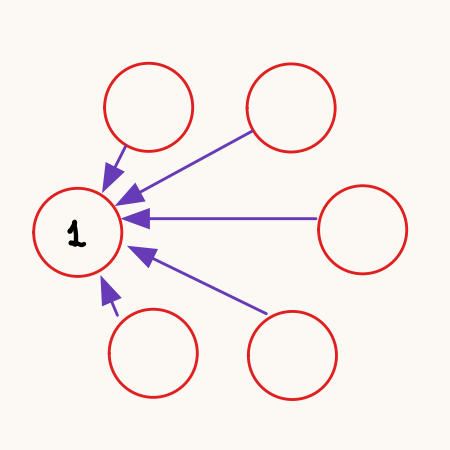
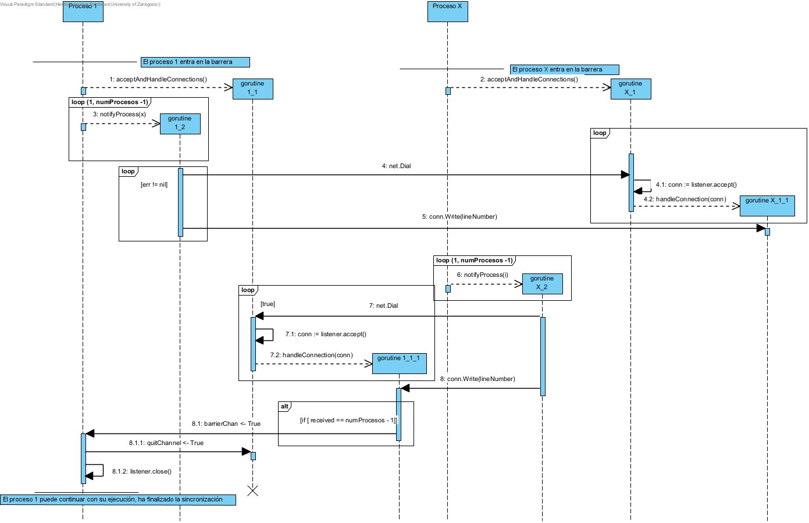

% Memoria Práctica 1 \
    Conceptos y Mecanismos Básicos \
    Sistemas Distribuidos 
% Autor: Héctor Lacueva Sacristán \
    NIP: 869637 \
    GRUPO TARDES 3-3
% Fecha: 02/06/2025

\newpage

# Introducción

En esta práctica, se busca abordar los conceptos clave de los sistemas distribuidos, diseñando varias arquitecturas, midiendo el rendimiento de la red y creando un mecanismo de sincronización distribuida. El objetivo principal es asignar adecuadamente las tareas a los recursos computacionales disponibles y analizar la Calidad de Servicio (QoS) bajo diferentes condiciones.

Recursos Computacionales Disponibles:

- Máquinas del lab102:
  - Procesadores i5-9500 con múltiples núcleos e hilos para pruebas intermedias.
- Cluster de Raspberry Pi 4 Model B:
  - El procesador de una Raspberry Pi 4 Model B (ARM Cortex-A72) tiene 4 cores con 1 hilo por core, que nos van a permitir ejecutar, por lo tanto, hasta 4 instancias en
    paralelo de nuestra aplicación. Estas máquinas cuentan con 7.6 GB.
  - Se cuenta con 4 máquinas dentro del mismo, máquinas r13 (192.168.3.13) a r16 (192.168.3.16) del cluster.
  - Para cada máquina tenemos a nuestra disposición 10 puertos (del 29180 al 29189).
  - Se accede a ellas a través de ssh desde las **máquinas del lab102** o bien desde **central**.

La práctica incluye la medición de tiempos en conexiones de red (TCP y UDP), la implementación de una barrera distribuida y el diseño de varias arquitecturas distribuidas (cliente-servidor y master-worker).


# Análisis de Prestaciones de Red

Para cada caso se han ejecutado 7 pruebas y se ha extraído la media de los resultados.

## Prestaciones de red para conexión TCP

### Conexión TCP en la misma máquina

Ambos procesos son lanzados en la máquina r14 (192.168.3.14).
Se han obtenido los siguientes resultados:

|Resultado|Prueba 1|Prueba 2|Prueba 3|Prueba 4|Prueba 5|Prueba 6|Prueba 7|
|:-:|:-:|:-:|:-:|:-:|:-:|:-:|:-:|
|Error|529,38µs|654,73µs|551,565µs|573,454µs|675,101µs|682,433µs|549,88µs|
|Ok|1,055057ms|917,522µs|844,302µs|1,121964ms|997,429µs|976,91µs|1,023336ms|

La media por tanto es de **602.36µs** para el caso de fallo de conexión y de **0.9909ms** para el caso de conexión establecida.

### Conexión TCP en distinta máquina

El cliente es lanzado en la máquina r14 (192.168.3.14) y el servidor en la máquina r15 (192.168.3.15).
Se han obtenido los siguientes resultados:

|Resultado|Prueba 1|Prueba 2|Prueba 3|Prueba 4|Prueba 5|Prueba 6|Prueba 7|
|:-:|:-:|:-:|:-:|:-:|:-:|:-:|:-:|
|Error|695,093µs|635,111µs|636,019µs|850,129µs|729,796µs|719,167µs|638,518µs|
|Ok|1,228148ms|1,220815ms|1,358593ms|1,456926ms|1,107537ms|1,174574ms|1,236796ms|

La media por tanto es de **700.55µs** para el caso de fallo de conexión y de **1.2548ms** para el caso de conexión establecida.

### Conclusiones

#### Conclusiones con respecto fallo de Dial.

El coste de ejecutar la **operación Dial de TCP en Golang** se debe a que se encarga de establecer la conexión con un servidor.
Para ello, lleva a cabo el "**3-way-handshake**" propio del protocolo TCP:

1. Cliente envía `SYN`.
2. Servidor recibe `SYN` y envía recibe `SYN+ACK`.
3. Cliente recibe `SYN+ACK` y envía `ACK`.

Cuando **Dial falla**, en nuestro caso porque el servidor no está desplegado se lleva a cabo lo siguiente:

1. Cliente envía `SYN`.
2. Al no haber ningún proceso escuchando en el puerto al que se ha realizado la petición,
   el SO envía un `RST`, lo que lleva a un error de conexión.

Se llevan a cabo dos envíos, uno para `SYN` y otro para `RST`.

Cuando **Dial funciona correctamente** se realiza el protocolo completo, de ahí los tiempos superiores.

#### Conclusiones con respecto a la ejecución en máquinas diferentes.

Al ejecutar la operación en distinta máquina los paquetes deben ser enviados a través de la red del rack que conecta las diferentes máquinas, lo que conlleva un sobrecoste.
Al ejecutar las operaciones en la misma máquina los paquetes se envían a través de la red de la propia máquina, y por lo general, esta es más rápida que la red del rack.
Es por eso que los tiempos para la ejecución en la misma máquina sean menores que para distintas máquinas.

## Prestaciones de red para conexión UDP

### Envío de una letra con UDP en la misma máquina

Ambos procesos son lanzados en la máquina r14 (192.168.3.14).
Se han obtenido los siguientes resultados:

|Resultado|Prueba 1|Prueba 2|Prueba 3|Prueba 4|Prueba 5|Prueba 6|Prueba 7|
|:-:|:-:|:-:|:-:|:-:|:-:|:-:|:-:|
|Char Sent|296,296µs|321,37µs|286,778µs|294,055µs|326,185µs|354,981µs|320,019µs|

La media del RTT es de **314,241µs**.

### Envío de una letra con UDP en distinta máquina
El cliente ha sido lanzado en la máquina r14 (192.168.3.14) y el servidor en la máquina r15 (192.168.3.15).
Se han obtenido los siguientes resultados:

|Resultado|Prueba 1|Prueba 2|Prueba 3|Prueba 4|Prueba 5|Prueba 6|Prueba 7|
|:-:|:-:|:-:|:-:|:-:|:-:|:-:|:-:|
|Char Sent|606,167µs|517,426µs|590,333µs|558,333µs|559,889µs|656,24µs|565,5µs|

La media del RTT es de **579,127µs**.

### Conclusiones

La diferencia entre ejecutar en la misma máquina y en distintas es el tiempo de propagación de los mensajes.
En el caso de la misma máquina, el tiempo de propagación medio es de **157,120µs** (RTT = **314,241µs**) y en el caso de máquinas distintas es de **289,563µs** (RTT = **579,127µs**).
Al igual que en TCP al ejecutar en la misma máquina se obtienen resultados mejores (la red local es más rápida que la del rack).

# Sincronización Barrera Distribuida

Para la realización de esta parte, se nos ha proporcionado el código de una barrera distribuida simple.

## Análisis

El funcionamiento de esta barrera es muy simple, cuando **un proceso accede a la barrera**, **envía un mensaje a todos los demás procesos** y espera a haber recibido un mensaje del resto de procesos involucrados. Una vez ha **obtenido todos los mensajes**, la **sincronización** se considera **completada** y el **proceso puede salir** de la barrera.

### Funcionamiento y diagrama de secuencia

|Entrada a la barrera|Salida de la barrera|
|:-:|:-:|
|||
|Cuando accedes a la barrera informas a todos los demás procesos|Cuando has recibido los mensajes de todos los demás procesos puedes salir|

|Diagrama de secuencia|
|:-:|
||


## Solución propuesta

Para el correcto funcionamiento de la barrera, se debe esperar a recibir un mensaje a través de `barrierChan`(esto indica que se han recibido todos los mensajes). Se envía un mensaje a través del canal `quitChannel`(se encarga de finalizar la gorutina que acepta solicitudes). Por último se cierra el `listener`. El orden es así porque sino se dan bloqueos en accept y la gorutina de aceptación no acabará nunca (aunque finalizarán cuando termine el programa). Por último, simulamos que el programa continúa correctamente con una espera de 6 segundos para que se envíen correctamente todos los mensajes.

```go
func main () { 
    
    ...

    // Espero a recibir los n-1 mensajes que me toca recibir
    <-barrierChan

    // Informo de que ya no hay que recibir más peticiones
    quitChannel <- true

    // Cierro el listener para evitar el bloqueo en accept
    listener.Close()

    fmt.Println("Finished the synchronization")

    // Añadimos un tiempo para que se acaben de envíar los mensajes propios.
    time.Sleep(6 * time.Second)

}
```

# Arquitecturas cliente-servidor

## 1. Gorutina por petición

En este caso **el servidor crea una gorutina para atender a cada petición**.

|Diagrama de secuencia|
|:-:|
||
|En el diagrma se representa proceso de respuesta del servidor ante una petición por parte de un cliente|

## 2. Pool de gorutinas

En este caso **el servidor crea un pool de gorutinas** y cuando recibe una petición la **asigna a una gorutina**.

|Diagrama de secuencia|
|:-:|
||
|En el diagrma se representa proceso de respuesta del servidor ante una petición por parte de un cliente|

## 3. Master-Worker

En este caso se cuenta con **un servidor master** que se encarga de **asignar las peticiones del cliente** a otros **servidores workers**. Los **workers procesan la petición** y **devuelven el resultado al master para que este se lo devuelva al cliente**.

|Diagrama de secuencia|
|:-:|
||
|En el diagrma se representa proceso de respuesta del servidor ante una petición por parte de un cliente. Todos los servidores cuentan con un pool de gorutinas y conforme se reciben peticiones, se asignana a las distintas gorutinas. |


