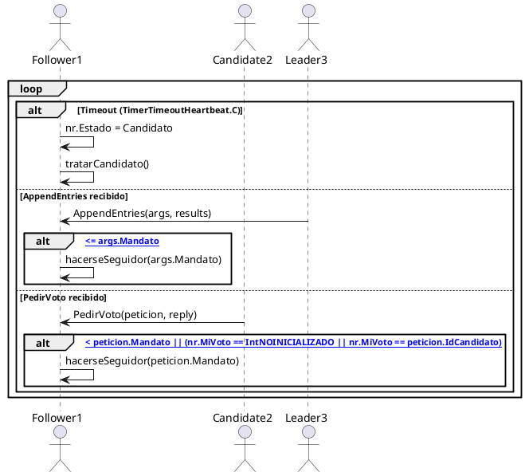
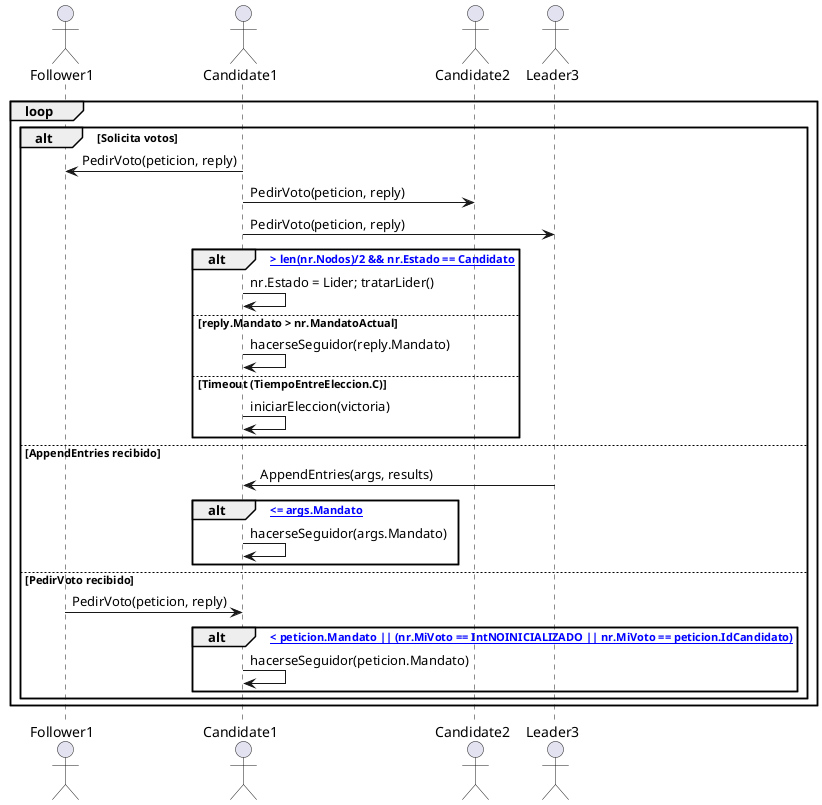
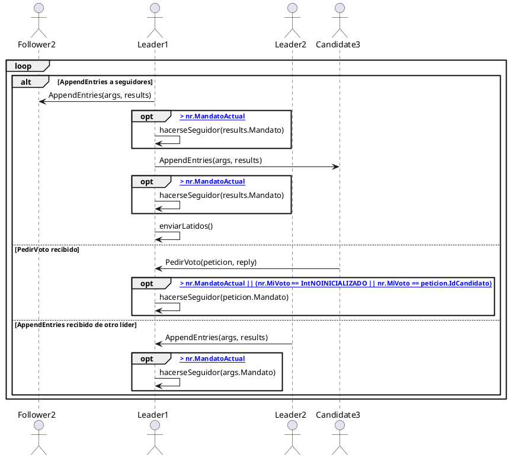

% Memoria Práctica 3 \
    Conceptos y Mecanismos Básicos \
    Sistemas Distribuidos 
%   Héctor Lacueva Sacristán \ NIP: 869637 \
    Adrián Nasarre Sánchez \ NIP: 869561 \
    GRUPO TARDES 3-3
% Fecha: 02/06/2025

\newpage

# Introducción

En esta memoria se describe el desarrollo de la Práctica 3 de Sistemas Distribuidos, centrada en la implementación del algoritmo de consenso Raft. El objetivo principal ha sido garantizar la consistencia de los datos replicados en un sistema distribuido tolerante a fallos, mediante la elección dinámica de líderes, la replicación de logs y la gestión de términos. El trabajo se ha realizado siguiendo las especificaciones de la asignatura y tomando como referencia la documentación oficial de Raft y los materiales proporcionados.

# Descripción de la Práctica

La práctica consiste en implementar una versión funcional del protocolo Raft, permitiendo la replicación de logs entre varios nodos y la tolerancia a fallos mediante la elección de líderes y la gestión de términos. Se han desarrollado los mecanismos de elección de líder, replicación de logs, persistencia de estado y gestión de fallos, así como una batería de pruebas de integración para validar el correcto funcionamiento del sistema.

# Diseño e Implementación

## Estructuras de Datos

La estructura principal es `NodoRaft`, que representa cada réplica del sistema. Sus campos principales son:

- **Nodos**: lista de direcciones de todos los nodos del clúster.
- **Yo**: identificador del nodo actual.
- **IdLider**: índice del nodo que actúa como líder.
- **MandatoActual**: término actual del nodo.
- **MiVoto**: nodo al que se ha votado en el mandato actual.
- **Log**: array de entradas de registro (`EntradaRegistro`), cada una con índice, mandato y operación (`TipoOperacion`).
- **Estado**: estado actual del nodo (`Seguidor`, `Candidato`, `Lider`).
- **VotacionRecibida**: canal para recibir votos.
- **Latido**: canal para recibir heartbeats.
- **Parado**: indica si el nodo está parado.
- **IndiceCommit**: última entrada comprometida.
- **SiguienteIndice** y **IndiceEntradaReplicada**: arrays para gestionar la replicación y sincronización de logs en los seguidores.

Otras estructuras relevantes:

- **TipoOperacion**: describe la operación a replicar (leer/escribir, clave, valor).
- **AplicaOperacion**: mensaje para aplicar una operación comprometida.
- **ArgsPeticionVoto** y **RespuestaPeticionVoto**: argumentos y respuesta para la petición de voto.
- **ArgAppendEntries** y **Results**: argumentos y respuesta para la replicación de logs y heartbeats.

## Funciones Principales

A continuación se describen en detalle las funciones implementadas en el algoritmo, razonando su lógica y su papel en el consenso Raft:

- **NuevoNodo**: Es el constructor del nodo Raft. Inicializa todos los campos de la estructura, crea los canales de comunicación, establece el estado inicial como seguidor y lanza la goroutine principal (`tratarNodo`) que implementa el autómata de estados de la operativa raft.

- **para**: Marca el nodo como parado y termina su ejecución tras un breve retardo. Es útil para simular la parada de un nodo en las pruebas y para liberar recursos. Se utiliza tanto en la API como en las pruebas de integración.

- **obtenerEstado**: Devuelve el identificador del nodo, el mandato actual, si el nodo cree ser el líder y el identificador del líder. Es fundamental para que los clientes y otros nodos puedan consultar el estado de cualquier réplica y para la lógica de redirección de operaciones.

- **someterOperacion**: Permite a un cliente enviar una operación (lectura o escritura). Si el nodo es líder, añade la operación al log y lanza la replicación a los seguidores, esperando a que la mayoría la confirme antes de responder. Si no es líder, informa al cliente del líder actual. Esta función implementa la lógica de consenso y compromiso de operaciones, asegurando la consistencia.

- **ParaNodo / DesconectarNodo**: Son RPCs que permiten parar o desconectar un nodo de forma remota. `ParaNodo` detiene el proceso, mientras que `DesconectarNodo` marca el nodo como parado lógicamente, útil para simular fallos en las pruebas.

- **ObtenerEstadoNodo / SometerOperacionRaft**: RPCs para consultar el estado de un nodo o someter una operación remotamente. Son la interfaz entre los clientes y el clúster Raft, y permiten la integración con las pruebas automatizadas.

- **PedirVoto / concederVoto**: Gestionan las peticiones de voto durante una elección. `PedirVoto` comprueba el mandato y el historial de votos, y si corresponde, llama a `concederVoto` para otorgar el voto al candidato. Se asegura que cada nodo solo vote una vez por mandato y que los votos se concedan de forma segura.

- **AppendEntries**: RPC utilizada por el líder para enviar heartbeats y replicar entradas de log. Valida el mandato, actualiza el líder y el log si es necesario, y responde con éxito o fracaso según la consistencia del log. Es esencial para mantener la autoridad del líder y la coherencia entre réplicas.

- **enviarPeticionVoto / enviarAppendEntries**: Métodos cliente para enviar peticiones de voto o AppendEntries a otros nodos mediante RPC. Gestionan los timeouts y errores de red, devolviendo si la comunicación fue exitosa. Permiten la comunicación distribuida y la tolerancia a fallos.

- **tratarVotoValido**: Procesa la respuesta a una petición de voto. Si se recibe un voto, incrementa el contador y, si se alcanza la mayoría, notifica la victoria. Si se detecta un mandato superior, el nodo vuelve a ser seguidor. Esta función es clave para la transición de candidato a líder.

- **tratarLatidoValido**: Procesa la respuesta a un heartbeat enviado por el líder. Si el seguidor tiene un mandato superior, el líder se convierte en seguidor. Permite la detección de líderes obsoletos y la actualización del mandato.

- **tratarAppendEntriesValido**: Procesa la respuesta a la replicación de una entrada de log. Si la replicación es exitosa, actualiza los índices de seguimiento y, si se alcanza la mayoría, avanza el commit. Si hay errores o mandatos superiores, ajusta el estado o los índices. Es fundamental para el compromiso seguro de operaciones.

- **enviarLatidos**: El líder envía heartbeats periódicos a todos los seguidores para mantener su autoridad y detectar fallos. Utiliza goroutines para enviar los mensajes en paralelo y procesar las respuestas.

- **enviarPeticionesVoto**: El candidato envía peticiones de voto a todos los nodos, gestionando las respuestas y la lógica de mayoría. Permite iniciar y coordinar el proceso de elección de líder.

- **comprometerOperacion / enviarOperacionNodo**: Gestionan la replicación y el compromiso de operaciones en el log. `comprometerOperacion` coordina la replicación en paralelo y espera a la mayoría antes de confirmar la operación al cliente. `enviarOperacionNodo` reintenta la replicación hasta el éxito o hasta que el nodo deje de ser líder.

- **actualizarLog / logPrevioCorrecto**: Métodos auxiliares para mantener la coherencia del log. `logPrevioCorrecto` valida la consistencia del log previo antes de aceptar nuevas entradas. `actualizarLog` resuelve conflictos y actualiza el log local según las entradas recibidas.

- **iniciarEleccion / hacerseSeguidor**: `iniciarEleccion` incrementa el mandato, se vota a sí mismo y lanza las peticiones de voto. `hacerseSeguidor` actualiza el estado y el mandato cuando se detecta un líder o mandato superior. Son esenciales para la gestión de los ciclos de elección y la recuperación ante fallos.

- **argumentosPeticionVoto / argumentosAppendEntries / argumentosLatido**: Preparan los argumentos necesarios para las distintas RPCs, extrayendo la información relevante del estado local. Facilitan la comunicación eficiente y segura entre nodos.

- **tratarNodo / tratarSeguidor / tratarCandidato / tratarLider**: Implementan el autómata principal del nodo. `tratarNodo` selecciona el comportamiento según el estado. `tratarSeguidor` espera heartbeats o peticiones de voto, `tratarCandidato` inicia elecciones y espera resultados, y `tratarLider` envía heartbeats y gestiona la replicación. Este autómata es el núcleo de la tolerancia a fallos y la coordinación distribuida en Raft.

# Diagramas de Estados y Secuencia

## Diagrama de Estados

A continuación se debe incluir un diagrama de estados que muestre las transiciones entre los estados de Seguidor, Candidato y Líder:

|Máquina de estados|
|:-:|
||

### Tabla de transiciones de la máquina de estados

| Estado inicial | Estado final | Condición (evento/código)                                   | Salida/Acción (función/efecto)                  |
|----------------|-------------|------------------------------------------------------------|--------------------------------------------------|
| Seguidor       | Candidato   | Timeout: `<-timeOut.C` en `tratarSeguidor()`               | `nr.Estado = Candidato`                          |
| Seguidor       | Seguidor    | Latido: `<-nr.Latido` en `tratarSeguidor()`                | Reinicia temporizador                            |
| Seguidor       | Seguidor    | Voto dado: `<-nr.VotacionRecibida` en `tratarSeguidor()`   | Reinicia temporizador                            |
| Candidato      | Líder       | Victoria: `<-victoria` en `tratarCandidato()`              | `nr.Estado = Lider`, reinicializa índices        |
| Candidato      | Seguidor    | Latido: `<-nr.Latido` en `tratarCandidato()`               | `nr.Estado = Seguidor`                           |
| Candidato      | Candidato   | Timeout: `<-timeOut.C` en `tratarCandidato()`              | Llama a `iniciarEleccion()`                      |
| Candidato      | Seguidor    | reply.Mandato > nr.MandatoActual en `tratarVotoValido()` o `tratarLatidoValido()` | `hacerseSeguidor(reply.Mandato)`                 |
| Líder          | Seguidor    | Latido: `<-nr.Latido` en `tratarLider()`                   | `nr.Estado = Seguidor`                           |
| Líder          | Seguidor    | results.Mandato > nr.MandatoActual en `tratarLatidoValido()` | `hacerseSeguidor(results.Mandato)`               |
| Líder          | Líder       | Timeout: `<-timeOut.C` en `tratarLider()`                  | Llama a `enviarLatidos()`                        |

## Diagramas de Secuencia

A continuación se muestran tres diagramas de secuencia (uno por tipo de nodo) que ilustran la comunicación entre los nodos Raft. En cada mensaje o evento se indica la llamada exacta del código Go (función y argumentos relevantes).

---

### Nodo Follower

---

### Nodo Candidate

---

### Nodo Leader

---

En cada diagrama se representan los bucles de espera, las alternativas de eventos y las llamadas exactas del código Go que implementan la lógica de Raft en cada estado.

# Pruebas Realizadas

A continuación se describen en detalle las pruebas de integración implementadas para validar el correcto funcionamiento del sistema Raft:

## T1: soloArranqueYparada
**Objetivo:** Verificar que tras el arranque del clúster, ningún nodo se proclama líder si no hay actividad ni heartbeats.

**Secuencia:**
- Se inician los tres nodos del clúster.
- Se consulta el estado de cada nodo para comprobar que todos están en el mandato 0, no se consideran líderes y no hay líder asignado.
- Se detienen todos los nodos.

**Validación:**
- Ningún nodo debe autoproclamarse líder sin haber recibido heartbeats ni haber iniciado un proceso de elección.
- El sistema permanece estable y sin liderazgo hasta que se produzca actividad.

## T2: ElegirPrimerLider
**Objetivo:** Comprobar que el sistema es capaz de elegir correctamente un primer líder en un entorno estable.

**Secuencia:**
- Se arrancan los tres nodos del clúster.
- Se espera a que se produzca una elección de líder.
- Se consulta el estado de todos los nodos para verificar que solo uno se considera líder y el resto son seguidores.
- Se detienen todos los nodos.

**Validación:**
- Solo debe haber un líder en el clúster.
- El resto de nodos deben reconocer al líder y actuar como seguidores.
- El mandato debe incrementarse respecto al arranque inicial.

## T3: FalloAnteriorElegirNuevoLider
**Objetivo:** Validar la tolerancia a fallos y la capacidad de reelección automática de un nuevo líder tras la caída del anterior.

**Secuencia:**
- Se inicia el clúster y se espera a que se elija un líder.
- Se desconecta el nodo líder simulado un fallo.
- Se espera un tiempo suficiente para que se detecte la caída y se inicie una nueva elección.
- Se consulta el estado de los nodos restantes para comprobar que se ha elegido un nuevo líder.
- Se detienen todos los nodos.

**Validación:**
- Tras la desconexión del líder, debe elegirse automáticamente un nuevo líder entre los nodos activos.
- El sistema debe seguir funcionando y manteniendo el consenso.

## T4: tresOperacionesComprometidasEstable
**Objetivo:** Comprobar la replicación y compromiso de operaciones en un entorno estable, y la correcta redirección de peticiones a través del líder.

**Secuencia:**
- Se arranca el clúster y se espera a que se elija un líder.
- Se identifica un nodo que no es líder y se le envía una operación; el sistema debe redirigir la petición al líder.
- Se envían tres operaciones consecutivas al líder.
- Se comprueba que las operaciones se replican y comprometen correctamente en la mayoría de nodos.
- Se detienen todos los nodos.

**Validación:**
- Las operaciones enviadas a un nodo no líder deben ser redirigidas correctamente al líder.
- Todas las operaciones deben quedar comprometidas y replicadas en la mayoría de nodos, garantizando la consistencia.
- El sistema responde correctamente a las peticiones de los clientes y mantiene la integridad del log.

# Resultados y Conclusiones

Las pruebas realizadas demuestran que la implementación cumple con los requisitos del algoritmo Raft: se elige un único líder, se detectan y recuperan fallos de nodos, y las operaciones se replican y comprometen correctamente en la mayoría de nodos. El sistema es robusto ante fallos y garantiza la consistencia de los datos replicados. La gestión de concurrencia mediante goroutines y canales, junto con el uso de RPCs, permite una coordinación eficiente y tolerante a fallos en el clúster distribuido.

La práctica ha permitido profundizar en los conceptos de consenso distribuido, tolerancia a fallos y replicación de estado, y la solución desarrollada es fiable y extensible para futuras mejoras.
